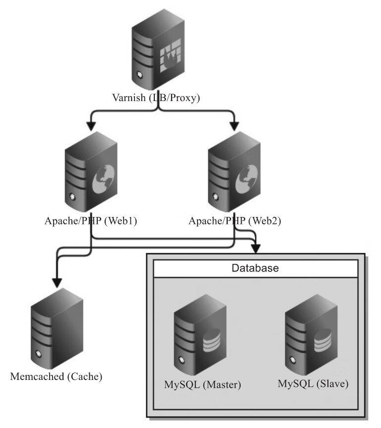

### Ansible密码认证

```bash
- name: Manage authorized keys
  ansible.builtin.authorized_key:
    user: "<username>"
    state: "<present/absent>"
    key: "<ssh_public_key>"
    key_options: "<optional_key_options>"
    path: "<optional_custom_path>"

```

user: 指定要为哪个用户管理authorized_key文件
state: 指定要添加`present`还是删除`absent`公钥,默认`present`
key: 添加或删除的ssh公钥字符串
key_options: 公钥的额外选项,禁止使用该 SSH 公钥进行端口转发`no-port-forwarding`,禁止使用 SSH 代理转发`no-agent-forwarding`
path: 指定`authorized_keys`文件的自定义路径,默认是`/home/<user>/.ssh/authorized_keys`

这里的key可以通过一个lookup插件获取当前主机的私钥,实现与远程主机的认证传递
```yaml
---
- hosts: all
  tasks:
    - name: Manage authorized keys
      ansible.builtin.authorized_key:
        user: "root"
        state: "present"
        key: "{{ lookup('file','/root/.ssh/id_rsa.pub') }}"
        key_options: "no-port-forwarding,no-agent-forwarding"
        path: "/root/.ssh/authorized_keys"
```

> no-port-forwarding 禁止使用该 SSH 公钥进行端口转发  
> 端口转发通常用于将本地或远程端口映射到远程服务器上的其他端口，这样可以通过 SSH 隧道安全地访问服务或系统资源  
> 
> 如果设置了 no-port-forwarding，那么即使用户可以通过 SSH 登录到服务器，他们也无法使用 -L 或 -R 选项进行端口转发  
> 
> no-agent-forwarding 禁止使用 SSH 代理转发  
> SSH 代理转发通常用于在登录到一台服务器后，在该服务器上自动使用本地机器上的 SSH 密钥，访问其他服务器或服务  
> 
> 如果设置了 no-agent-forwarding，即使用户使用了 -A 选项登录，他们也无法使用代理转发功能。这增加了安全性，因为不允许远程服务器使用用户本地的 SSH 密钥进行其他操作  

### SSH 公钥端口转发 (Port Forwarding)  

端口转发是一种通过 SSH 隧道将本地或远程端口映射到另一台机器上的端口的技术  
#### 本地端口转发 (Local Port Forwarding)
- 本地端口转发允许你将本地计算机上的某个端口（如 localhost:8080）通过 SSH 隧道转发到远程服务器的某个端口。这通常用于访问内部网络中的服务，这些服务从你的本地计算机直接访问可能是不允许的
- 例如，如果远程服务器 remote-server.com 可以访问内部网络中的数据库，但你在本地计算机上无法直接访问该数据库，你可以使用本地端口转发将请求通过 SSH 隧道发送到远程服务器，再由远程服务器将请求转发到内部网络中的数据库

```bash
ssh -L 8080:internal-db-server:3306 user@remote-server.com 
```
这条命令会将本地的 localhost:8080 转发到 remote-server.com 上的 internal-db-server:3306，你可以通过访问 localhost:8080 来访问远程的数据库服务

#### 远程端口转发 (Remote Port Forwarding)
- 远程端口转发允许你将远程服务器上的某个端口通过 SSH 隧道转发到本地计算机的某个端口。这通常用于将远程服务器上的服务暴露给本地或其他计算机使用
- 例如，如果你想从远程服务器暴露一个 web 服务到你的本地计算机，你可以使用远程端口转发
```bash
ssh -R 8080:localhost:80 user@remote-server.com 
```
这条命令会将远程服务器 remote-server.com 上的 localhost:8080 端口转发到本地计算机的 80 端口。

SH 公钥端口转发允许你通过安全的 SSH 隧道在本地和远程服务器之间传输数据，通常用于安全地访问网络资源或暴露服务

### SSH 代理转发 (Agent Forwarding)
SSH 代理转发 是指通过 SSH 连接将本地机器上的 SSH 代理（SSH agent）转发到远程服务器。SSH 代理是一种管理 SSH 密钥的工具，它可以在需要时提供私钥，避免你每次都要输入密码或私钥的密码短语

使用 SSH 代理转发的典型场景是

你从本地机器 A 连接到远程服务器 B，但你还需要从 B 连接到另一个远程服务器 C，而不想将私钥复制到 B。通过代理转发，B 可以使用 A 上的私钥来连接 C，而不需要在 B 上存储私钥

```bash
ssh -A user@remote-server.com
```

使用 -A 选项启用代理转发。当你在 remote-server.com 上尝试 SSH 连接其他服务器时，会使用本地计算机上的 SSH 代理。

代理转发的风险：

如果攻击者获得了你在 B 上的 SSH 会话，他们可以使用代理转发到其他服务器。因此，除非绝对必要，不建议启用 SSH 代理转发。

### authorized keys模块使用示例

/etc/ansible/hosts
```ini
[ubuntu]
192.168.255.110
[centos]
192.168.255.101 

[ubuntu:vars]
ansible_ssh_user="root"
ansible_ssh_pass="root"
[centos:vars]
ansible_ssh_user="root"
ansible_ssh_pass="root"
```

```bash
ansible-playbook playbook.yaml 

PLAY [all] ******

TASK [Gathering Facts] ******
ok: [192.168.255.110]
ok: [192.168.255.101]

TASK [Manage authorized keys] **************************************************************************************************************
changed: [192.168.255.110]
changed: [192.168.255.101]

PLAY RECAP ******
192.168.255.101            : ok=2    changed=1    unreachable=0    failed=0    skipped=0    rescued=0    ignored=0   
192.168.255.110            : ok=2    changed=1    unreachable=0    failed=0    skipped=0    rescued=0    ignored=0 
```

### copy与shell模块实现
```bash
- hosts: all
  tasks:
    - name: Manage authorized keys
      ansible.builtin.copy:
        state: "present"
        src: "/root/.ssh/id_rsa.pub"
        dest: "/tmp/id_rsa.pub"
    - name: Manage authorized keys
      shell: "cat /tmp/id_rsa.pub >> /root/.ssh/authorized_keys"
```

### ssh-copy-id 
于复制指定用户的公钥至远程服务器,同时修改~/.ssh的目录权限。Linux入门必备,因其功能的局限性,主机较多时频繁输入密码较麻烦,主机量少时可以使用

```bash
ssh-copy-id -i /home/user1/.ssh/id_rsa.pub user2@remote-server-ip
```

### Kickstart
RedHat下主要的自动化安装配置工具的Kickstart可以完成系统的认证
[Kickstart官网](https://docs.redhat.com/zh_hans/documentation/red_hat_enterprise_linux/7/html/installation_guide/chap-kickstart-installations#sect-kickstart-introduction)

### Python Paramiko

Paramiko是用Python语言写的一个模块,遵循SSH2协议,支持以加密和认证的方式进行远程服务器的连接  
Paramiko支持Linux、Solaris、BSD、MacOS X、Windows等平台通过SSH从一个平台连接到另外一个平台  
利用该模块,可以方便地进行SSH连接,以及通过SFTP协议进行SFTP文件传输

```python
# !/usr/bin/python3
# -*- coding: utf-8 -*-
import paramiko

def sshe(ip,username,passwd,cmd):
 try:
   ssh = paramiko.SSHClient()
   ssh.set_missing_host_key_policy(paramiko.AutoAddPolicy())
   ssh.connect(ip,22,username,passwd)
   stdin,stdout,stderr = ssh.exec_command(cmd)
   print(stdout.read())
   print("%s\tOK\n"%(ip))
   ssh.close()
 except :
   print("%s\tError\n"%(ip))
     
sshe("192.168.255.110","root","root","hostname;ifconfig")
```

SSHClient方法下的connect提供很多功能参数,本案例使用了ip、port、username、passwd

### 高可用架构


这是个老图了,这里将Varnish换成nginx做代理
- nginx在前端接入层同时扮演负载均衡和反向代理的角色，将接收到的请求路由至后面WebServers 
- Apache结合PHP的经典WebServers架构对外提供Web服务
- 通过Memcached的Cache功能过滤数据库查询请求负载后，再将请求转发至后端MySQL数据库
- MySQL是通用主从架构，通常采用InnoDB存储引擎，主从时时同步，以主写从读的方式来缓解压力和提高存储层的可用性

#### Playbook目录编排

```ini
lamp-infrastructure/
inventories/
playbooks/
db/
memcached/
nginx/
www/
provisioners/
configure.yml
provision.yml
requirements.yml
Vagrantfile
```


